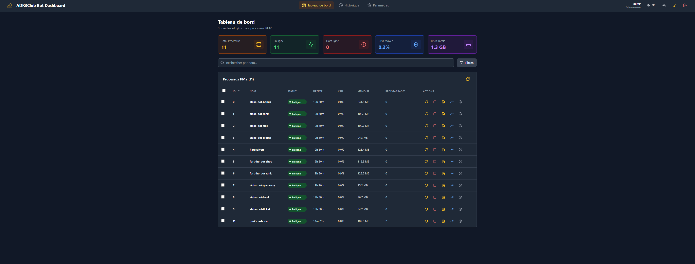
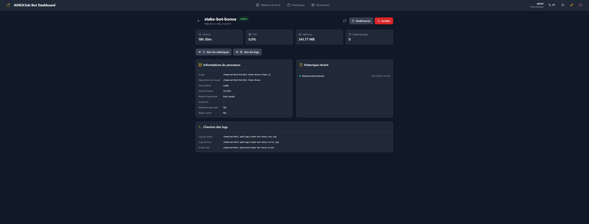
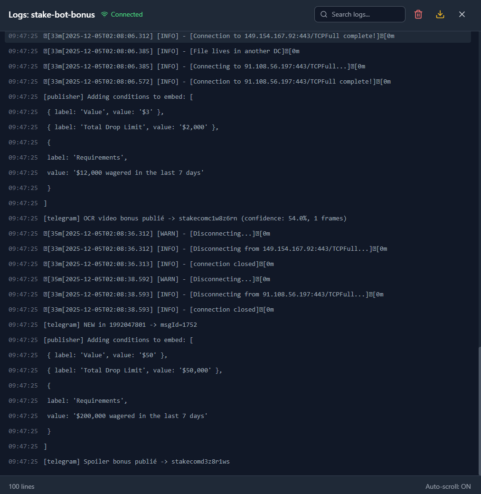
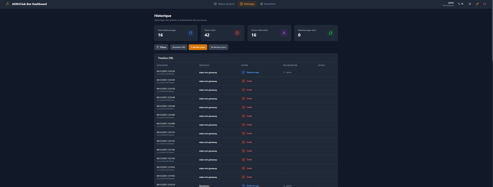
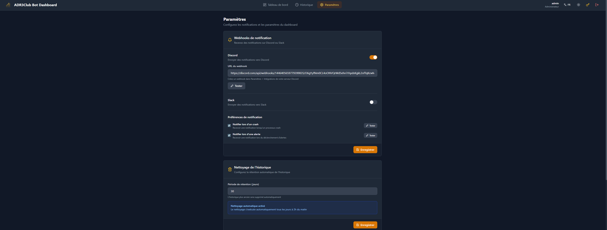
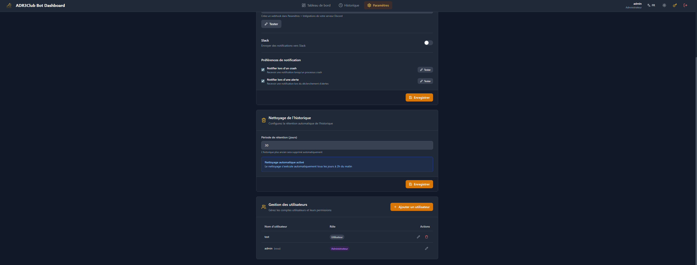

# PM2 Dashboard

<div align="center">


**Dashboard web moderne pour gérer et monitorer vos processus PM2 en temps réel.**

[Features](#features) • [Installation](#installation) • [Déploiement](#déploiement) • [API](#api-endpoints) • [Configuration](#configuration)

</div>

---

## Screenshots

<div align="center">

### Dashboard Principal

*Vue d'ensemble de tous vos processus PM2 avec statistiques en temps réel*

### Détail Processus

*Informations détaillées, métriques et historique par processus*

### Métriques Temps Réel

*Graphiques CPU/RAM avec historique jusqu'à 24h*

### Logs en Direct

*Streaming des logs avec recherche et export*

### Historique des Événements

*Timeline complète des crashes, restarts et actions*

### Paramètres & Webhooks

*Configuration des notifications Discord/Slack*

### Gestion Utilisateurs

*Gestion des comptes utilisateurs et permissions*

</div>

---

## Features

### Dashboard
- **Table des processus** - ID, nom, statut, uptime, CPU, RAM, restarts
- **Cards statistiques** - Total processus, en ligne, hors ligne, CPU moyen, RAM totale
- **Recherche & filtres** - Par nom ou statut (online/stopped/errored)
- **Actions groupées** - Restart/Stop multiple avec sélection
- **Thème dark/light** - Toggle avec persistance
- **Multi-langue** - Français / English

### Gestion des Processus
- **Actions individuelles** - Start, Stop, Restart par processus
- **Page de détail** - Informations étendues (script, cwd, interpreter, node version, exec mode)
- **Historique récent** - Derniers événements du processus
- **Chemins des logs** - Accès rapide aux fichiers de logs

### Métriques Temps Réel
- **Graphiques interactifs** - CPU et Mémoire avec Recharts
- **Stockage Redis** - Historique jusqu'à 24h de données
- **Plages temporelles** - 10 min, 1h, 6h, 24h
- **60 points optimisés** - Data thinning pour performance
- **Export CSV** - Téléchargement des données
- **Filtres** - Affichage CPU seul, RAM seule, ou les deux

### Logs en Direct
- **Streaming SSE** - Logs en temps réel
- **Historique** - Chargement des 100 dernières lignes
- **Recherche** - Filtrage dans les logs
- **Auto-scroll** - Toggle on/off
- **Export** - Téléchargement des logs

### Historique des Événements
- **Timeline complète** - Crashes, restarts, stops, starts
- **Statistiques** - Total restarts, crashes, actions manuelles, auto-restarts
- **Filtres avancés** - Par processus, type d'action, période
- **Plages de dates** - 24h, 7 jours, 30 jours
- **Nettoyage automatique** - Configurable (rétention en jours)

### Système d'Alertes
- **Détection de crash** - Notification automatique
- **Processus instable** - Alerte si X crashes en Y minutes
- **Niveaux de sévérité** - Critical, High, Medium
- **Bannière d'alertes** - Affichage dans le dashboard
- **Dismiss** - Ignorer les alertes traitées

### Webhooks & Notifications
- **Discord** - Notifications riches avec embeds
- **Slack** - Messages formatés
- **Types de notifications** :
  - Crash de processus
  - Alertes (processus instable)
- **Boutons de test** - Test individuel par type de notification
- **Validation d'URL** - Format webhook vérifié

### Gestion Utilisateurs
- **Authentification JWT** - Tokens sécurisés avec expiration
- **Rôles** - Admin / User
- **CRUD utilisateurs** - Création, modification, suppression (admin)
- **Changement de mot de passe** - Pour tous les utilisateurs
- **Validation** - Username min 3 chars, password min 12 chars

---

## Stack Technique

### Backend
| Technologie | Usage |
|------------|-------|
| **Node.js** | Runtime JavaScript |
| **Express** | Framework HTTP |
| **PM2 API** | Gestion des processus |
| **SQLite** | Base de données (users, historique, settings) |
| **Redis** | Stockage des métriques (24h) |
| **SSE** | Server-Sent Events pour temps réel |
| **JWT + bcrypt** | Authentification sécurisée |
| **Helmet.js** | Headers de sécurité |

### Frontend
| Technologie | Usage |
|------------|-------|
| **React 19** | Framework UI |
| **Vite** | Build tool |
| **TailwindCSS** | Styling (dark/light mode) |
| **Recharts** | Graphiques interactifs |
| **React Query** | Gestion état serveur |
| **Zustand** | Gestion état client |
| **Lucide React** | Icônes |

---

## Installation

### Prérequis
- Node.js v18+
- PM2 installé globalement (`npm i -g pm2`)
- Redis server (pour les métriques 24h)
- Git

### 1. Cloner le repository
```bash
git clone https://github.com/your-username/Dashboard-Bots.git
cd Dashboard-Bots
```

### 2. Backend
```bash
cd backend
npm install

# Configurer les variables d'environnement
cp .env.example .env
# Éditer .env avec vos valeurs (voir Configuration)

# Initialiser la base de données
npm run init-db
# Crée l'admin: username=admin, password=admin123
```

### 3. Frontend
```bash
cd ../frontend
npm install
```

### 4. Développement
```bash
# Terminal 1 - Backend
cd backend && npm run dev

# Terminal 2 - Frontend
cd frontend && npm run dev
```

- Backend: http://localhost:3000
- Frontend: http://localhost:5173

---

## Déploiement

### 1. Build le frontend
```bash
cd frontend
npm run build
# Les fichiers sont dans frontend/dist/
```

### 2. Configurer le backend
```bash
cd backend
cp .env.example .env
nano .env  # Configurer pour production

# Initialiser la DB
npm run init-db

# Changer le mot de passe admin (via l'interface ou recréer l'utilisateur)
npm run create-user admin VotreMotDePasseSecure123
```

### 3. Démarrer avec PM2
```bash
# Depuis la racine du projet
pm2 start ecosystem.config.js
pm2 save
pm2 startup  # Auto-start au boot
```

### 4. (Optionnel) Nginx reverse proxy
```nginx
server {
    listen 80;
    server_name your-domain.com;

    location / {
        proxy_pass http://localhost:3000;
        proxy_http_version 1.1;
        proxy_set_header Upgrade $http_upgrade;
        proxy_set_header Connection 'upgrade';
        proxy_set_header Host $host;
        proxy_cache_bypass $http_upgrade;

        # SSE support
        proxy_buffering off;
        proxy_cache off;
        proxy_read_timeout 86400s;
    }
}
```

### 5. HTTPS avec Let's Encrypt
```bash
sudo apt install certbot python3-certbot-nginx
sudo certbot --nginx -d your-domain.com
```

---

## API Endpoints

### Authentification
| Méthode | Endpoint | Description |
|---------|----------|-------------|
| POST | `/api/auth/login` | Connexion |
| POST | `/api/auth/verify` | Vérifier token |
| GET | `/api/auth/me` | Info utilisateur actuel |
| POST | `/api/auth/change-password` | Changer mot de passe |

### Processus
| Méthode | Endpoint | Description |
|---------|----------|-------------|
| GET | `/api/processes` | Liste tous les processus |
| GET | `/api/processes/:id` | Détails d'un processus |
| POST | `/api/processes/:id/restart` | Redémarrer |
| POST | `/api/processes/:id/stop` | Arrêter |
| POST | `/api/processes/:id/start` | Démarrer |

### Logs
| Méthode | Endpoint | Description |
|---------|----------|-------------|
| GET | `/api/logs/:id/stream` | Stream SSE temps réel |
| GET | `/api/logs/:id/history` | Dernières lignes |
| GET | `/api/logs/:id/export` | Télécharger les logs |

### Métriques
| Méthode | Endpoint | Description |
|---------|----------|-------------|
| GET | `/api/metrics/stream` | Stream SSE des métriques |
| GET | `/api/metrics/:id?range=60` | Métriques historiques (range en minutes) |

### Historique
| Méthode | Endpoint | Description |
|---------|----------|-------------|
| GET | `/api/history/timeline` | Timeline des événements |
| GET | `/api/history/statistics` | Statistiques |
| DELETE | `/api/history/clean?days=30` | Nettoyer ancien historique |

### Alertes
| Méthode | Endpoint | Description |
|---------|----------|-------------|
| GET | `/api/alerts` | Alertes actives |
| POST | `/api/alerts/:id/dismiss` | Ignorer une alerte |

### Paramètres
| Méthode | Endpoint | Description |
|---------|----------|-------------|
| GET | `/api/settings/webhooks` | Config webhooks |
| PUT | `/api/settings/webhooks` | Mettre à jour webhooks |
| POST | `/api/settings/webhooks/test` | Tester webhook |
| POST | `/api/settings/webhooks/test-crash` | Tester notif crash |
| POST | `/api/settings/webhooks/test-alert` | Tester notif alerte |
| GET | `/api/settings/cleanup` | Config nettoyage |
| PUT | `/api/settings/cleanup` | Mettre à jour nettoyage |

### Utilisateurs (Admin)
| Méthode | Endpoint | Description |
|---------|----------|-------------|
| GET | `/api/users` | Liste utilisateurs |
| POST | `/api/users` | Créer utilisateur |
| PUT | `/api/users/:id` | Modifier utilisateur |
| DELETE | `/api/users/:id` | Supprimer utilisateur |

---

## Configuration

### Variables d'environnement (.env)

```env
# Server
NODE_ENV=production
PORT=3000

# Security
JWT_SECRET=your-super-secret-key-minimum-32-chars
JWT_EXPIRATION=24h

# Database
DB_PATH=./database.sqlite

# Redis (pour métriques 24h)
REDIS_ENABLED=true
REDIS_HOST=localhost
REDIS_PORT=6379
REDIS_PASSWORD=
REDIS_DB=0

# CORS
CORS_ORIGIN=https://your-domain.com

# Rate Limiting
RATE_LIMIT_WINDOW=15
RATE_LIMIT_MAX=5
```

### PM2 Ecosystem (ecosystem.config.js)

```javascript
module.exports = {
  apps: [{
    name: 'pm2-dashboard-api',
    script: './backend/src/server.js',
    cwd: __dirname,
    instances: 1,
    autorestart: true,
    max_memory_restart: '200M',
    env: {
      NODE_ENV: 'production',
      PORT: 3000
    }
  }]
};
```

---

## Sécurité

- **JWT** - Tokens avec expiration 24h
- **bcrypt** - Hash des mots de passe (salt rounds 10)
- **Rate limiting** - 5 tentatives / 15 min sur login
- **CORS** - Origine restreinte
- **Helmet.js** - Headers HTTP sécurisés
- **Validation** - URLs webhook validées
- **Rôles** - Séparation admin/user

---

## Scripts

### Backend
```bash
npm start          # Démarrer en production
npm run dev        # Démarrer avec hot reload
npm run init-db    # Initialiser la base de données
npm run create-user <user> <password>  # Créer/modifier utilisateur
```

### Frontend
```bash
npm run dev        # Serveur de développement
npm run build      # Build production
npm run preview    # Preview du build
```

---

## Troubleshooting

### Le dashboard ne se connecte pas à PM2
```bash
# Vérifier que PM2 tourne
pm2 list

# Le dashboard doit tourner sous le même utilisateur que PM2
```

### Redis ne fonctionne pas
```bash
# Vérifier que Redis est démarré
redis-cli ping

# Vérifier la connexion
redis-cli -h localhost -p 6379
```

### Les métriques ne s'affichent pas
```bash
# Vérifier les logs du backend
pm2 logs pm2-dashboard-api

# Les métriques sont collectées toutes les 10 secondes
# Attendre quelques minutes pour avoir des données
```

### Erreur de base de données
```bash
# Réinitialiser la base de données
cd backend
rm database.sqlite
npm run init-db
```

---

## License

MIT

---

## Support

Pour toute question ou problème, ouvrir une issue sur GitHub.

---

<div align="center">

**Made with** by [ADR3Club](https://github.com/ADR3Club)

</div>
